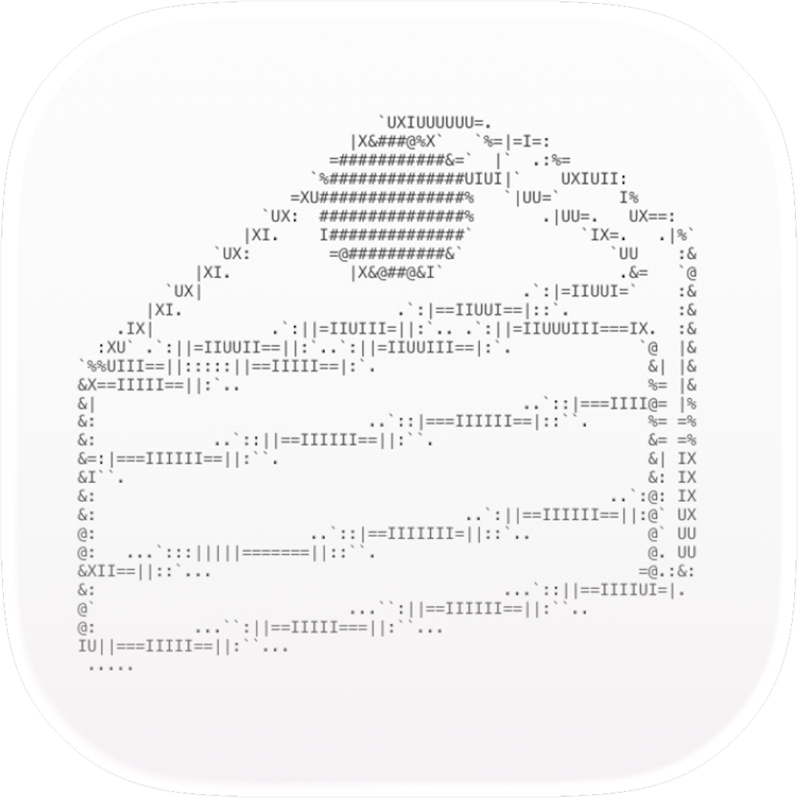

<h1 align="center"> Keeki </h1>  

  

  A student interested in iOS mobile app development, especially apps designed for learning and education.

<h1 align="center"> Link </h1>  

	<a href="https://keeki-fami.github.io/">
		My Portfolio(and other links)
	</a>

<h1 align="center"> Interest </h1>  

    Swift  
    iOS mobile app development  
    electronic work  
    competitive programming  
    hardware security  
    UI/UX  

<h1 align="center"> Skills </h1>  

  

<h1 align="center"> Products </h1>  

|name|description|platform|
|---|---|---|
| Ebbinghaus|Review your study materials at the right time, track your learning progress, and build lasting memories.Ebbinghaus helps you study smarter with spaced repetition.|iOS 18+|

<h1 align="center"> Contacts </h1>  

- Email: keekiapp.feedback@gmail.com
- X : [@Keeki_factory](https://x.com/keeki_factory?s=11)
